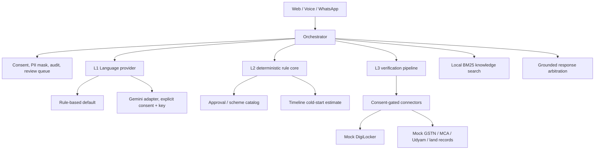

# Tri-Layer Intelligence Architecture

`src/services/` is the service boundary for AI-facing features. Phase A providers are typed and Zod-validated; the existing `/api/saathi` route remains for compatibility while `/api/ai/chat` is the orchestrated gateway.

## Trust ordering

L1 classifies, extracts slots, and phrases replies. It does not decide statutory obligations or claim document verification. L2 is the only source for rule-derived approvals, risk, schemes, and time estimates. L3 returns evidence and checks; only a live, authorized source adapter can establish real source verification. If evidence is absent, the demo returns `NEEDS_REVIEW` or hands off. A mock DigiLocker fixture is explicitly marked simulated and must not be represented as government-verified.

The Gemini adapter uses `GEMINI_API_KEY`, `GEMINI_MODEL`, and optional `GEMINI_PRO_MODEL`. It is selected only when a signed-in user gives purpose-specific `external_ai/process-chat` consent. PII is masked before model calls. A numeric-claim guard rejects a reply containing numbers absent from the L2/L3 fact set and falls back to the rule-based response.

## Phase A limitations

Consent, audit, and human-review stores are in-memory adapters and are lost on restart. Phase A supplies interfaces and mock implementations only. Phases B/C add dependency planning, production-grade historical timelines, calendars, and uncertainty simulation; Phases D/E add persisted documents, OAuth, OCR, deterministic validation, and officer review. No statutory decision is automated.